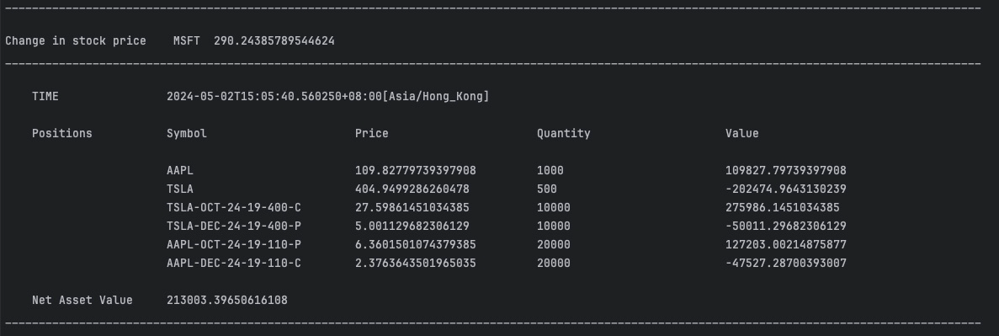

# Portfolio Viewer

- Portfolio Viewer calculates the prices fo the securities in your Portfolio 
- Portfolio initial snapshot is provided in a CSV file in resources/position directory of the source path
- There is a dummy market created where the stocks price changes and published

## Technologies used in the Application

- Java 8 (As stated in the problem statement)
- H2 as Im-memory DB (As suggested in the problem statement)
- SpringBoot
- SpringBoot embedded Active MQ
- Gradle as build tool

## How to Run the application

1. Download the application from Git in a directory 
2. Please keep the port 8080 free as the application will run on port 8080
3. Run below command from project root directory (use terminal or cmd)
   1. For Mac / Linux
      ```./gradlew bootRun```
   2. For Windows
      ```./gradlew bootRun```
4. Now the application will start and you will see the Portfolio Viewer banner
5. Once the application is started and the initial Portfolio is loaded the application will take a pause of 4 seconds before starting the market
6. Once fully started you can start seeing the console subscriber pretty logs as below
   
   
   
7. The H2 database can be accessed on  the host user and password details can be found in application.yaml file 
   http://localhost:8080/h2-console/login.jsp


